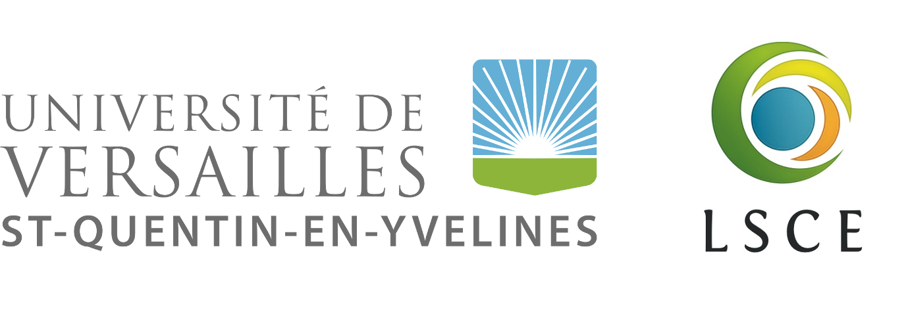

# Contributors & Contact

EO-LINCS is delivered by a consortium of four partners, bringing together data infrastructure, software engineering, ground measurement, and carbon-cycle science and modelling.

## Consortium

| SN | Institution | Role | |
|----|-------------|------|---|
| 1 | [Max Planck Institute for Biogeochemistry (MPI-BGC)](https://www.bgc-jena.mpg.de/) | Coordination; science cases SCS1 & SCS3 |  |
| 2 | [Brockmann Consult GmbH (BC)](https://www.brockmann-consult.de/about-us/) | Tool & data-store development (`xcube` / `xcube-multistore`) |  |
| 3 | [Laboratory of Climate and Environmental Sciences - University of Versailles Saint-Quentin-en-Yvelines (UVSQ-LSCE)](https://www.lsce.ipsl.fr/en/home-public/) | Science case SCS2 |  |
| 4 | [University of Exeter (UNEXE)](https://www.exeter.ac.uk) | Science case SCS4 |  |

## Get in contact

**Science cases and carbon-cycle science** — reach the EO-LINCS science leads at MPI-BGC:

[Contact the MPI-BGC science leads](mailto:skoirala@bgc-jena.mpg.de?cc=jnelson@bgc-jena.mpg.de&subject=EO-LINCS%20enquiry){: .btn .btn-primary }

Sujan Koirala (project coordination, SCS3) and Jacob A. Nelson (SCS1).

**Tool & technical development** — for questions about `xcube-multistore` and the data stores, reach the developers at Brockmann Consult:

[Contact the Brockmann Consult developers](mailto:konstantin.ntokas@brockmann-consult.de?cc=gunnar.brandt@brockmann-consult.de&subject=xcube-multistore%20enquiry){: .btn .btn-primary }

Konstantin Ntokas and Gunnar Brandt.

## Contribute to the tools

All EO-LINCS software is open-source. Contributions — bug reports, feature requests, and pull requests — are welcome:

- **Science-case pipelines** — the four repositories under the [EO-LINCS GitHub organization](https://github.com/EO-LINCS): [`eo-lincs-scs1`](https://github.com/EO-LINCS/eo-lincs-scs1), [`eo-lincs-scs2`](https://github.com/EO-LINCS/eo-lincs-scs2), [`eo-lincs-scs3`](https://github.com/EO-LINCS/eo-lincs-scs3), [`eo-lincs-scs4`](https://github.com/EO-LINCS/eo-lincs-scs4).
- **Core framework** — [`xcube-multistore`](https://github.com/xcube-dev/xcube-multistore) and the individual `xcube` data-store plugins under the [`xcube-dev` organization](https://github.com/xcube-dev). Open an issue or pull request on the relevant repository.

For general project information, see the [external project webpage](https://eo-lincs.github.io/) and the [internal project organization](https://github.com/EO-LINCS/eo-lincs-org).
