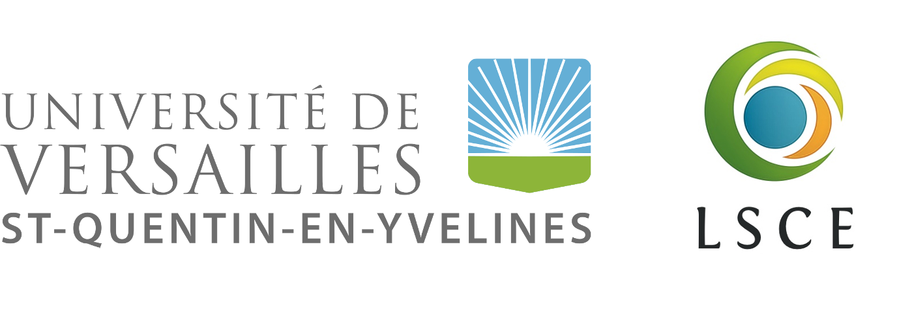

# Overview

Under ESA Carbon Science Cluster: Research Opportunities 2 – Theme 2: Carbon Data Enquiry And Benchmarking, the EO-LINCS (Earth Observation, Local and Integrated data eNquiry for Terrestrial Carbon Science) promotes a community effort towards an enhanced multi-mission assessment of the terrestrial carbon cycle at resolutions in space and time compatible with decision making by improving the access to the Earth Observation (EO) data for the wider carbon scientific community so that key questions related to scale, representativeness, consistency, reliability, as well as the applicability of the multivariate EO data and how they affect our understanding of the carbon cycle processes across spatial and temporal scales can be addressed. 

# Problem Statement
Despite the clear progresses in carbon cycle studies fuelled by the growth of EO, there are several underlying challenges that may hinder the applicability of EO data (see Figure below). First of all, the vegetation processes operate across a large spectrum of spatial and temporal scales, e.g., photosynthesis occurs at a molecular to cell scale and is instantaneous, while growth is at individual level over multiple years. The ecosystem/site measurements of the flux exchanges are at ecosystem scale at sub-daily temporal scale, EO measurements are at the spatial and temporal scale of a given satellite with differences across orbits and instruments, and model processes representations and simulations are at a typically large grid cell that differ across models. The ramifications of these differences can only be reconciled with systematic approaches that integrate strengths from all three perspectives. In fact, site level observation, EO, and carbon models are equally important and complementary to each other because observations are only available for contemporary period, satellites need ground observations for calibrations and verifications, and models require observed parameters and variables to be able to constrain uncertainties in future.

*EO-LINCS Background: A non-exhaustive general overview of the state-of-the-art in Earth Observation, ecosystem site measurements, and models used in the quantification of carbon cycle variables. The polygons indicate either a representative grid cell or footprint. The waves indicate frequency of the data available, with higher temporal frequency for site measurements. The blue color indicates the time where observations are available (recent past), and red indicates a time domain where models have to be used (future). The boxes indicate carbon fluxes and states, which are underlined by key ecosystem processes, and are often quantified by all methods from different perspectives, resulting in potential inconsistencies in representativeness and scale.*

# EO-LINCS Approach and Objectives

The proposed approach in EO-LINCS is to facilitate the assimilation of EO data streams into carbon cycle research through the lowering of technological barriers to entry. The key philosophy is the identification that data production and scientific analysis are two integral parts of the same system which aims to improve carbon cycle understanding through efficient usage of reliable EO data. The core of this approach is to develop bespoke data production pipelines for four distinct SCSs in an iterative, co-design framework between the scientific and technological partners. 

*A conceptual outline of proposed integrated approach in EO-LINCS*

The EO-LINCS proposes to 

- provide an integrated approach from data infrastructure, software engineering, ground measurement, and carbon cycle science and modelling perspectives.

- interactively assess the applicability of multiple EO dataset in enhancing the understanding of key carbon cycle processes. 

## Scientific Case Studies

### SCS1: Explanatory power of novel EO data streams for predicting net carbon fluxes
> *Exploration of novel data streams to constrain net ecosystem exchange estimates at flux towers and analysis of EO product added value via explainable machine learning.*

A working data processing chain to incorporate Sentinel 3 data into the FLUXCOM-X framework that is updatable and expandable to all sites and other Sentinel data products. An analysis of the contributions of Sentinel 3 data for predicting NEE and analysis into the added value with regards to interannual variability, drought responses, and disturbance.

### SCS2: Forest recovery post disturbance

> *To quantify and understand the temporal dynamics of forest biomass during disturbance and recovery in the chosen region.*

New high-resolution height/biomass maps that are expected to enable the monitoring of biomass at finer scales, in particular the impact of fine scale forest disturbances due to management practices such as thinning and the impact of natural disturbances (insects attacks, droughts, fires and windthrown in regions of interest). Analysis of forest recovery depending on environmental factors (such as climate, soil composition and pH) and the nature and intensity of disturbance shall aid in the optimization of forest management considering potential increased future disturbances.

### SCS3: Model-Data Fusion for Understanding Carbon State-Flux Relationships Across Space

> *Use EO data to constrain and understand the carbon state-flux relationships across spatial gradients.*

Use a terrestrial carbon model structure that can deliver a process understanding of carbon state-flux relationships across space by leveraging and cross-comparing EO data of biomass and vegetation states (fAPAR, LAI, vegetation fraction, etc.) together with ecosystem carbon flux measurements and estimates. Additionally, provide open-source novel MDI tools and workflows for community use paving the way for adoption by other data-assimilation frameworks.

### SCS4: EO enhanced benchmarking of GCB DGVMs
> *Better constrain component processes (productivity and turnover; particularly in response to disturbances and land management) that determine the European land carbon sink, and the partitioning into vegetation and soil carbon pools.*

New observational constraints will be used to evaluate the suite of Dynamic Global Vegetation Models (DGVMs) that contribute to the Global Carbon Budget (GCB) synthesis reports. There will be special attention paid to both managed and unmanaged land. We will enhance ILAMB evaluation tool with a focus on internal carbon dynamics and temporal change able to provide novel insights into DGVM capabilities to simulate the European land carbon sink and identify its main drivers. The spatiotemporal analysis will enable us to produce a roadmap for model improvements, in particular regarding forest management.

## Project Partners

| | ||
|----|----|----|
|SN|Institution||
|1|[Max Planck Institute for Biogeochemistry (MPI-BGC)](https://www.bgc-jena.mpg.de/)|
|
|2|[Brockmann Consult GmBH (BC)](https://www.brockmann-consult.de/about-us/)|
|
|3|[Laboratory of Climate and Environmental Sciences - University of Versailles Saint-Quentin-en-Yvelines (UVSQ-LSCE)](https://www.lsce.ipsl.fr/en/home-public/) |
|
|4|[University of Exeter (UNEXE)](https://www.exeter.ac.uk) |
|

