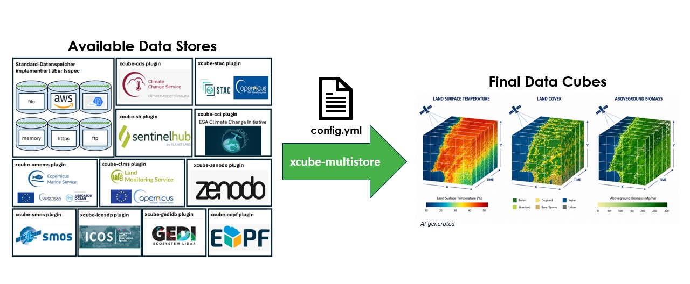

# Overview

Under ESA Carbon Science Cluster: Research Opportunities 2 – Theme 2: Carbon Data Enquiry And Benchmarking, the EO-LINCS (Earth Observation, Local and Integrated data eNquiry for Terrestrial Carbon Science) promotes a community effort towards an enhanced multi-mission assessment of the terrestrial carbon cycle at resolutions in space and time compatible with decision making by improving the access to the Earth Observation (EO) data for the wider carbon scientific community so that key questions related to scale, representativeness, consistency, reliability, as well as the applicability of the multivariate EO data and how they affect our understanding of the carbon cycle processes across spatial and temporal scales can be addressed. 

# Problem Statement
Despite the clear progresses in carbon cycle studies fuelled by the growth of EO, there are several underlying challenges that may hinder the applicability of EO data (see Figure below). First of all, the vegetation processes operate across a large spectrum of spatial and temporal scales, e.g., photosynthesis occurs at a molecular to cell scale and is instantaneous, while growth is at individual level over multiple years. The ecosystem/site measurements of the flux exchanges are at ecosystem scale at sub-daily temporal scale, EO measurements are at the spatial and temporal scale of a given satellite with differences across orbits and instruments, and model processes representations and simulations are at a typically large grid cell that differ across models. The ramifications of these differences can only be reconciled with systematic approaches that integrate strengths from all three perspectives. In fact, site level observation, EO, and carbon models are equally important and complementary to each other because observations are only available for contemporary period, satellites need ground observations for calibrations and verifications, and models require observed parameters and variables to be able to constrain uncertainties in future.

*EO-LINCS Background: A non-exhaustive general overview of the state-of-the-art in Earth Observation, ecosystem site measurements, and models used in the quantification of carbon cycle variables. The polygons indicate either a representative grid cell or footprint. The waves indicate frequency of the data available, with higher temporal frequency for site measurements. The blue color indicates the time where observations are available (recent past), and red indicates a time domain where models have to be used (future). The boxes indicate carbon fluxes and states, which are underlined by key ecosystem processes, and are often quantified by all methods from different perspectives, resulting in potential inconsistencies in representativeness and scale.*

# EO-LINCS Approach and Objectives

The proposed approach in EO-LINCS is to facilitate the assimilation of EO data streams into carbon cycle research through the lowering of technological barriers to entry. The key philosophy is the identification that data production and scientific analysis are two integral parts of the same system which aims to improve carbon cycle understanding through efficient usage of reliable EO data. The core of this approach is to develop bespoke data production pipelines for four distinct SCSs in an iterative, co-design framework between the scientific and technological partners. 

*A conceptual outline of proposed integrated approach in EO-LINCS*

The EO-LINCS proposes to 

- provide an integrated approach from data infrastructure, software engineering, ground measurement, and carbon cycle science and modelling perspectives.

- interactively assess the applicability of multiple EO dataset in enhancing the understanding of key carbon cycle processes. 

# Unified Data Access: xcube-multistore

A central technical outcome of EO-LINCS is [**`xcube-multistore`**](xcube-multistore) — an open-source Python package that **unifies data access and processing** across many Earth Observation archives. Rather than delivering fixed data products or cubes, EO-LINCS delivers **open data pipelines and a framework** for accessing and combining *multiple* EO data streams into analysis-ready cubes.

`xcube-multistore` orchestrates a suite of `xcube` data-store plugins (for the Copernicus Land Monitoring Service, Zenodo, Sentinel data via STAC, GEDI, the ICOS Data Portal, the Copernicus Data Store, the ESA Climate Change Initiative, and more), harmonising them behind a single, configuration-driven workflow. Data extraction becomes a single notebook whose sources, variables, spatial domain and resolution are set in a YAML configuration — making the same pipeline reusable and expandable far beyond the project.

*Conceptual overview of the `xcube-multistore` Python package.*

The four **[Science Case Studies](science-cases)** below demonstrate these pipelines on real carbon-cycle problems. Across all four cases, the majority of the EO data was accessed through EO-LINCS — the tools were central, not incidental, to the results. Learn more on the [xcube-multistore page](xcube-multistore).

## Scientific Case Studies

Each science case is demonstrated in a public, reproducible repository and documented in the project deliverables. **Click a case for its dedicated page** with the science background, data access, links to the notebooks, and main results.

### [SCS1: Explanatory power of novel EO data streams for predicting net carbon fluxes](science-cases/scs1)
> *Exploration of novel data streams to constrain net ecosystem exchange estimates at flux towers and analysis of EO product added value via explainable machine learning.*

### [SCS2: Forest recovery post disturbance](science-cases/scs2)

> *To quantify and understand the temporal dynamics of forest biomass during disturbance and recovery in the chosen region.*

### [SCS3: Model-Data Fusion for Understanding Carbon State-Flux Relationships Across Space](science-cases/scs3)

> *Use EO data to constrain and understand the carbon state-flux relationships across spatial gradients.*

### [SCS4: EO enhanced benchmarking of GCB DGVMs](science-cases/scs4)
> *Better constrain component processes (productivity and turnover; particularly in response to disturbances and land management) that determine the European land carbon sink, and the partitioning into vegetation and soil carbon pools.*

## Project Partners

EO-LINCS is delivered by a consortium of four partners. See the [Contributors & Contact](contributors) page for the full consortium, how to get in touch, and how to contribute to the tools.
