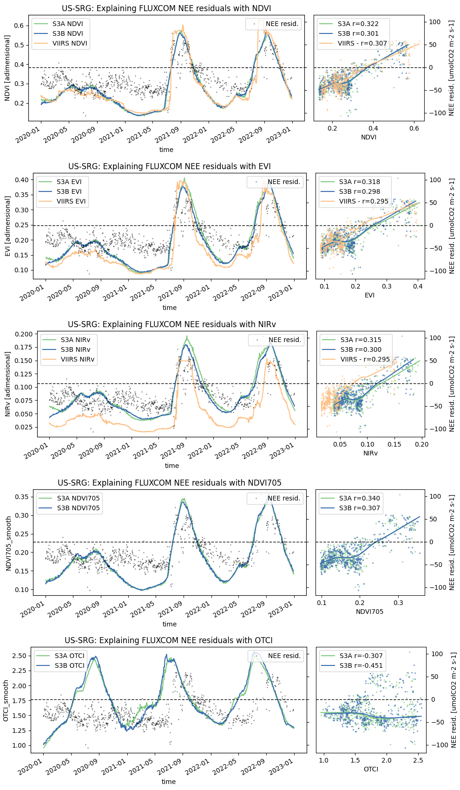
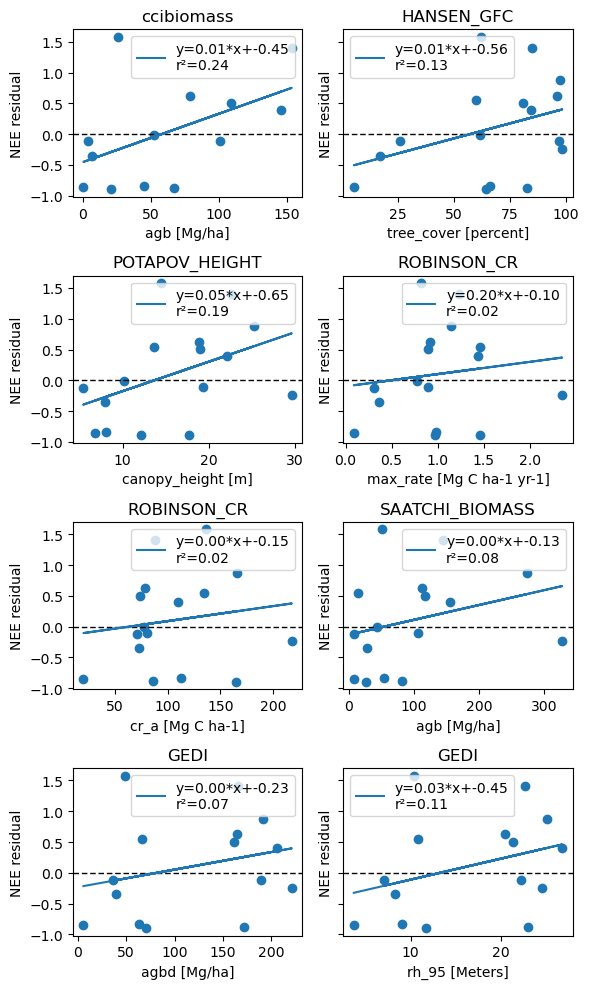

# SCS1: Explanatory power of novel EO data streams for predicting net carbon fluxes

**Lead:** Jacob A. Nelson (Max Planck Institute for Biogeochemistry)
{: .fs-5 }

[View the code & notebooks on GitHub](https://github.com/EO-LINCS/eo-lincs-scs1){: .btn .btn-primary }

## Objective

SCS1 aims to link EO data streams to *in situ* data to predict carbon, water, and energy fluxes. The approach builds on the **FLUXCOM-X** methodology, where meteorological and reflectance data from satellites are used to train a machine-learning model on a target flux. While the test case uses FLUXCOM-X, the pipeline is applicable to any use case that matches EO data to eddy-covariance measurements — here based on eddy-covariance data from FLUXNET and associated networks (ICOS, AmeriFlux).

The outcome is a working data-processing chain able to incorporate new EO data — including Sentinel-2 and Sentinel-3 — into the FLUXCOM-X framework, updatable and expandable to all sites and other products. The example case demonstrates the potential utility of these new data streams for predicting Net Ecosystem Exchange (NEE), with particular attention to interannual variability, drought responses, and disturbance.

## Code & notebooks

The public repository [**`eo-lincs-scs1`**](https://github.com/EO-LINCS/eo-lincs-scs1) contains:

- [`data_extraction/`](https://github.com/EO-LINCS/eo-lincs-scs1/tree/main/data_extraction) — the step-by-step cube-generation notebook (`data_extraction.ipynb`) driven by the [xcube Multi-Source Data Store](https://xcube-dev.github.io/xcube-multistore/), plus `config.yml` and `sites.csv` (the flux-tower sites to extract).
- [`scientific_analysis/`](https://github.com/EO-LINCS/eo-lincs-scs1/tree/main/scientific_analysis) — the analysis of the extracted cubes.

## Data access

EO products are extracted as spatial cut-outs (2 km radius, centred on each flux tower), enabling flexible footprint aggregation. Datasets and the `xcube` plugin serving each:

| Data used | Accessed via |
|---|---|
| Eddy-covariance fluxes (FLUXNET / ICOS / AmeriFlux) | *in situ* target (not via EO-LINCS) |
| MODIS / VIIRS legacy predictors | existing FLUXCOM-X |
| Sentinel-2 L2A · Sentinel-3 SYN / LST | **`xcube-stac`** |
| ERA5 hourly time series | **`xcube-cds`** |
| ESA CCI Biomass · GEDI · EOForestSTAC | **`xcube-cci` / `xcube-gedidb` / `xcube-stac`** |

ERA5 access via the Copernicus Data Store requires a personal CDS API token (see the [`xcube-cds`](https://github.com/xcube-dev/xcube-cds) docs). See the [xcube-multistore page](../xcube-multistore) for the full list of stores.

## Main results

The work is a **proof of concept** for incorporating novel EO streams into flux up-scaling, developed along three threads.

**Temporal variability (Sentinel-3).** At the strongly water-limited Santa Rita Grassland (US-SRG), Sentinel-3 SYNERGY vegetation indices (NDVI, EVI, NIRv) show good agreement with VIIRS in overall temporal patterns — despite only simple LOESS smoothing versus VIIRS's mature gap-filled/smoothed workflow. Preliminary `SYN_flags` screening leaves fewer outliers than MODIS/VIIRS. Crucially, when compared against cross-validated FLUXCOM-X NEE residuals, *the explained variance from Sentinel-3A and Sentinel-3B was consistently higher than from VIIRS, and red-edge indices ($NDVI_{705}$, OTCI) showed higher correlations still* — pointing to added value from Sentinel-3's spectral capabilities. Results are preliminary and may be site-specific.

*Time series of Sentinel-3A/3B and VIIRS vegetation indices alongside cross-validated FLUXCOM-X NEE residuals (US-SRG).*

**Spatial variability (forest structure).** Site-level canopy height, above-ground biomass, tree cover, and Chapman–Richards growth-curve parameters were compared to the *spatial* component of FLUXCOM-X NEE residuals across 16 globally distributed sites. All forest-structure metrics show a weak but consistently positive relationship with the residuals, suggesting larger forest biomass/cover may be associated with systematic spatial errors in NEE. Sample size is small and confounded (productive ecosystems have both larger fluxes and higher biomass), and fixed-radius averaging does not match true tower footprints — motivating footprint-aware aggregation (e.g. using ICOS regions of interest).

*Spatial NEE residuals from 16 sites vs the 1 km mean of each forest characteristic.*

**Sentinel-2 cloud masking.** The deep-learning OmniCloudMask (needing only red/green/NIR, run directly on L2A) outperformed the standard Sen2Cor Scene Classification Layer, particularly for cloud shadows. A 7-pixel buffer plus a heuristic scene-quality score (valid-pixel fraction × spatial standard deviation) was introduced to auto-flag contaminated scenes.

**Impact.** The key limitations are *primarily technical rather than scientific, with many key barriers having been reduced with the EO-LINCS pipeline.* High-resolution products (Sentinel-2, forest structure, CCI Biomass) now have access speeds sufficient for full multi-site analysis (all **763 sites** currently available), while Sentinel-3 SYN throughput supports 20–100-site synthesis studies. Provider format matters enormously: Planetary Computer (Cloud-Optimised GeoTIFF) extractions are roughly an order of magnitude faster than CDSE (JPEG2000). 
