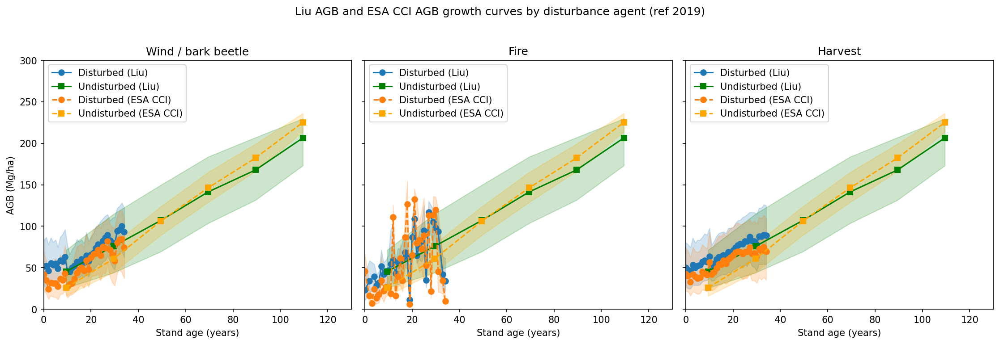
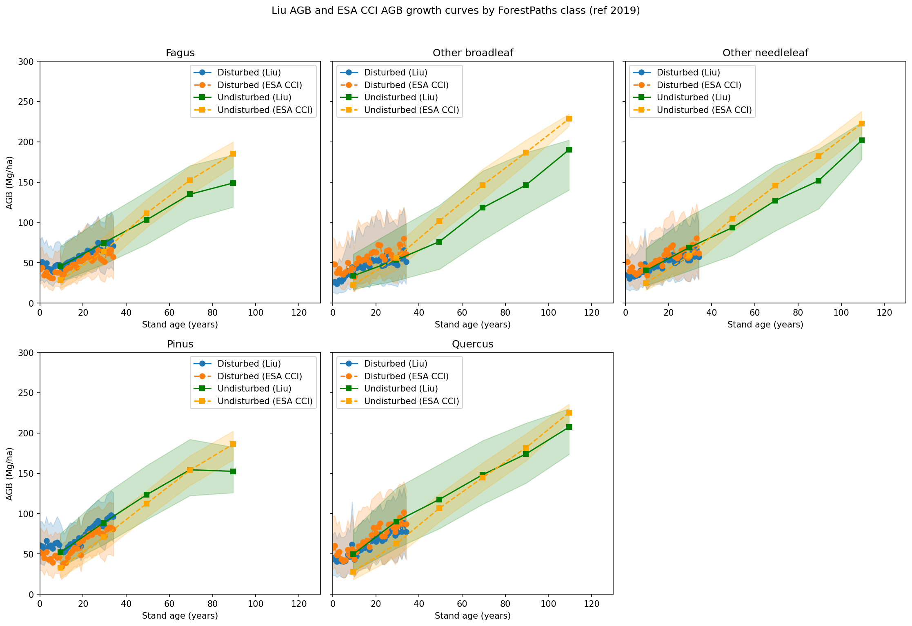

# SCS2: Forest recovery post disturbance

**Lead:** Agnès Pellissier-Tanon (UVSQ-LSCE, Laboratory of Climate and Environmental Sciences)
{: .fs-5 }

[View the code & notebooks on GitHub](https://github.com/EO-LINCS/eo-lincs-scs2){: .btn .btn-primary }

## Objective

SCS2 aims to estimate canopy-height and above-ground biomass (AGB) maps from remote-sensing data, and to use them to calculate forest **recovery curves** — AGB as a function of stand age — which in turn support carbon-budget estimation.

The outcome is new high-resolution height/biomass information enabling the monitoring of biomass at finer scales — in particular the impact of fine-scale forest disturbances from management (e.g. thinning) and natural disturbances (insect attacks, droughts, fires, windthrow). Analysis of forest recovery in relation to environmental factors and the nature and intensity of disturbance can aid the optimization of forest management under increasingly disturbance-prone climates.

## Code & notebooks

The public repository [**`eo-lincs-scs2`**](https://github.com/EO-LINCS/eo-lincs-scs2) contains:

- [`data_extraction/`](https://github.com/EO-LINCS/eo-lincs-scs2/tree/main/data_extraction) — cube generation via the [xcube Multi-Source Data Store](https://xcube-dev.github.io/xcube-multistore/).
- [`data_extraction_upscale/`](https://github.com/EO-LINCS/eo-lincs-scs2/tree/main/data_extraction_upscale) — a larger bounding box (covering France, 25000 × 25000 pixels) showcasing the **scalability** of the tool; run `prepare_gami.ipynb` then `data_extraction.ipynb`.
- [`scientific_analysis/`](https://github.com/EO-LINCS/eo-lincs-scs2/tree/main/scientific_analysis) — `01_data_processing.ipynb` and `02_data_visualization.ipynb` reproducing the D5.4 results.

## Data access

All inputs are reprojected to a common **30 m** grid. Datasets and the `xcube` plugin serving each:

| Data used | Accessed via |
|---|---|
| European Forest Disturbance Atlas (EFDA) | **`xcube-zenodo`** |
| Liu et al. AGB / canopy height / cover (30 m) | **`xcube-stac`** (EOForestSTAC) |
| ESA CCI Biomass v6.0 | **`xcube-cci`** |
| GAMI forest age · ForestPaths genus | **`xcube-stac`** (EOForestSTAC) |
| CLMS dominant leaf / forest type | **`xcube-clms`** |
| National Forest Inventory growth | external validation (not via EO-LINCS) |

CLMS data requires CLMS API credentials (see the [`xcube-clms`](https://github.com/xcube-dev/xcube-clms) docs), stored in a JSON file referenced from `config.yml`. Changing the region of interest is done by editing the `grid_mappings` option in the configuration before running extraction.

## Main results

**Demonstration region: Les Landes de Gascogne, France** — one of Europe's largest planted (maritime pine) forests, chosen because it experiences three disturbance agents: wind/bark-beetle (following storms Martin 1999 and Klaus 2009), fire (including the 2022 Gironde/Landiras fires), and harvest.

**Method.** Only forest pixels were retained (Copernicus/CLMS forest type > 0 → ~20.3 million forest pixels). Disturbed pixels were grouped by disturbance year and agent (from EFDA), with stand age = 2019 − disturbance year; undisturbed pixels were grouped by GAMI forest age in 20-year bins. For each stratum, empirical quantiles (25th/50th/75th) of biomass were computed — a non-parametric growth curve requiring no fitted growth function — using two AGB products (Liu et al. and ESA CCI) and stratified by ForestPaths genus.

*Median AGB (with 25th–75th percentile bands) vs stand age, by disturbance agent, for Liu and ESA-CCI biomass. From EO-LINCS D5.4.*

**Key findings.** The AGB values are reasonable and cross-consistent — *Liu and CCI ESA lead to similar results.* Stratifying by species revealed that *the tree genus seems to have a bigger impact on the AGB growth than the disturbance agent.* Height growth curves resemble the AGB curves with a slightly different shape, while canopy cover saturates early.

*AGB growth curves stratified by ForestPaths genus class. From EO-LINCS D5.4.*

**Impact (D5.1).** By integrating biomass, disturbance history, and age in a unified framework, the pipeline enables **user-tailored** growth curves (by species group, disturbance type, or even pixel level) — a substantial advance over static, predefined yield tables. The workflow is readily scalable to the whole of Europe because it uses the same species, disturbance, and biomass products; the [xcube-multistore how-to](https://xcube-dev.github.io/xcube-multistore/howto/) documents expanding and selecting regions. Derived growth curves are intended to be validated against independent National Forest Inventory data. Future work covers long-term disturbance maps beyond Europe (e.g. Hansen Global Forest Change, GABAM), uncertainty propagation, and a user-friendly interface for non-experts.
