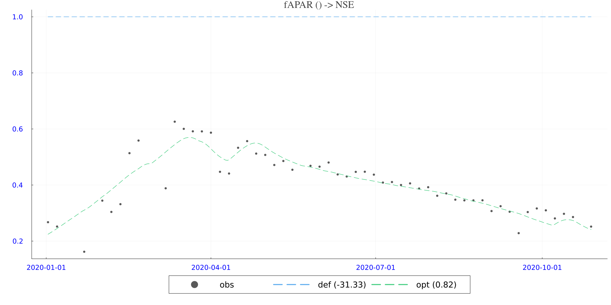

# SCS3: Model-Data Fusion for Understanding Carbon State–Flux Relationships Across Space

**Lead:** Sujan Koirala & Xu Shan (Max Planck Institute for Biogeochemistry)
{: .fs-5 }

[View the code & notebooks on GitHub](https://github.com/EO-LINCS/eo-lincs-scs3){: .btn .btn-primary }

## Objective

SCS3 aims to improve the accuracy of ecosystem carbon-cycle models by integrating *in situ* eddy-covariance observations (FLUXNET2015) with complementary EO products as inputs. Data cubes are generated so as to integrate seamlessly within the [**SINDBAD**](https://sindbad-mdi.org/) terrestrial ecosystem modelling framework.

The outcome is a terrestrial carbon-model structure that delivers process understanding of carbon state–flux relationships across space, by leveraging and cross-comparing EO data of biomass and vegetation states (fAPAR, vegetation fraction, etc.) together with ecosystem carbon-flux measurements — and providing open-source model-data-integration (MDI) tools and workflows for community use.

## Code & notebooks

The public repository [**`eo-lincs-scs3`**](https://github.com/EO-LINCS/eo-lincs-scs3) contains:

- [`data_extraction/`](https://github.com/EO-LINCS/eo-lincs-scs3/tree/main/data_extraction) — `data_extraction.ipynb` (cube generation via the [xcube Multi-Source Data Store](https://xcube-dev.github.io/xcube-multistore/)) and `process_data_documented.ipynb` (conversion to SINDBAD format).
- [`scientific_analysis/`](https://github.com/EO-LINCS/eo-lincs-scs3/tree/main/scientific_analysis) — `run_insitu_inversion.ipynb` / `.jl` (SINDBAD parameter inversion, in Julia), a fully documented `run_insitu_inversion.md`, and the SINDBAD configuration files.

See also the [SINDBAD framework](https://sindbad-mdi.org/) and the [SindbadTutorials.jl](https://github.com/LandEcosystems/SindbadTutorials.jl) tutorials.

## Data access

All forcing and EO products are extracted via the EO-LINCS Multi-Source Data Store (4 km box around each FLUXNET site, averaged to a footprint pixel; year 2020) and harmonised into a single-site Zarr/NetCDF cube. Datasets and the `xcube` plugin serving each:

| Data used | Accessed via |
|---|---|
| Sentinel-2 L2A → NDVI / fAPAR | **`xcube-stac`** |
| ESA CCI above-ground biomass | **`xcube-cci`** |
| ERA5-Land meteorological forcing | **`xcube-cds`** |
| FLUXNET2015 eddy-covariance (NEE, ancillary) | *in situ* (not via EO-LINCS) |

ERA5-Land access via the Copernicus Data Store requires a personal CDS API token (see the [`xcube-cds`](https://github.com/xcube-dev/xcube-cds) docs).

## Main results

**Approach.** Sentinel-2 NDVI (linked to fAPAR via a linear relationship) and ESA-CCI AGB were assimilated into the process-based model **WROASTED** (>40 parameters) within SINDBAD, using the CMA-ES optimiser. The cost combined normalised Nash–Sutcliffe efficiency (NNSE) for time series with an adjusted normalised MAE for the AGB stock. The demonstration was performed at the Australian savanna site **AU-Dry** for 2020.

**Key findings.** The optimised simulation tracks the observations markedly better than the default run, reflected in improved cost metrics. Assimilation improves the timing and amplitude of the seasonal cycle, reduces bias in mean AGB and NDVI/fAPAR levels, and the *joint improvement in both AGB and NDVI indicates that the optimised parameter set produces a more internally consistent representation of vegetation carbon dynamics.* The inversion mainly adjusts canopy radiative transfer / vegetation structure (e.g. tree fraction → 0.30, consistent with savanna), water-stress limitation on photosynthesis, and carbon residence/turnover times.

*Simulated (default vs optimised) and observed time series of NDVI at FLUXNET AU-Dry site for the year 2020.*

**Caveats.** Several parameters are pushed close to their bounds — *a common sign of equifinality and/or compensating errors.* Multiple EO constraints reduce, but do not eliminate, equifinality; additional constraints (e.g. GPP/ET) would help.

**Impact (D5.1).** The pipeline enables a clean, reproducible coupling between multi-source EO products and MDI assimilation: NDVI tightens seasonal timing/amplitude, while AGB constrains long-term carbon accumulation and turnover. The workflow is transferable across scales and plant functional types, and extensible to other EO products (Sentinel-1 C-band, ESA BIOMASS P-band TomoSAR, solar-induced fluorescence). Future work targets faster extraction/inversion, additional frequency bands, and parameter-uncertainty quantification to combat equifinality.
