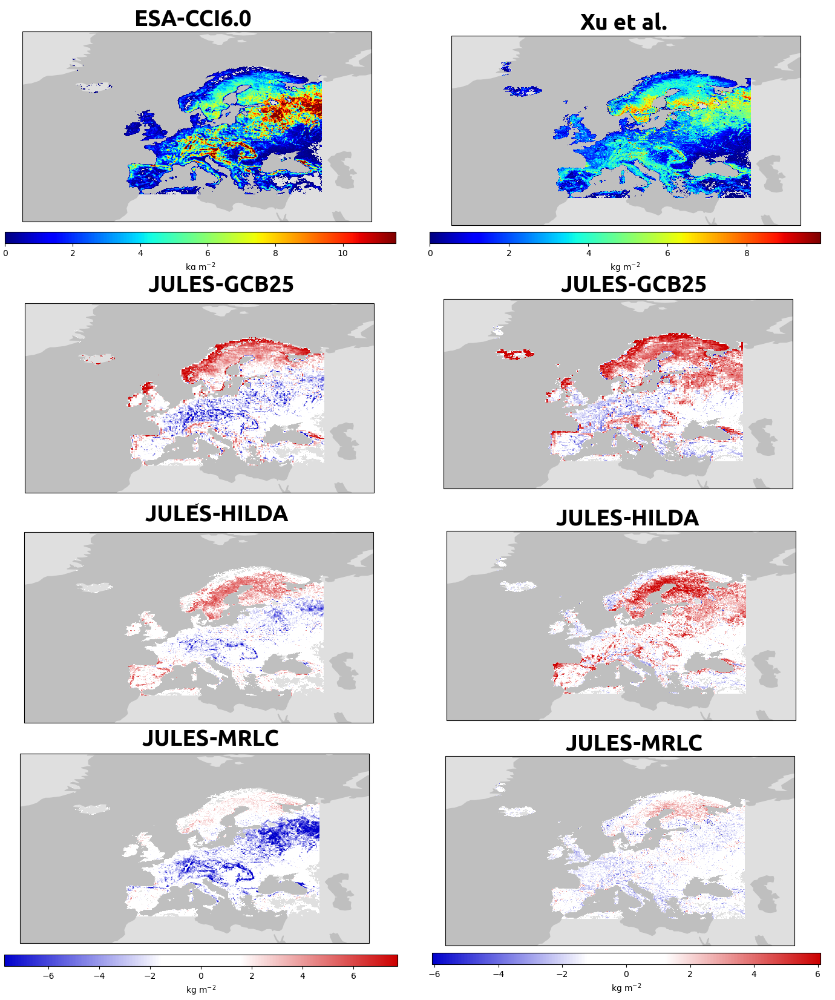
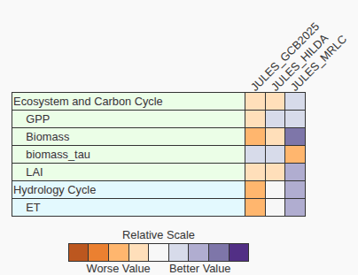

# SCS4: EO-enhanced benchmarking of GCB DGVMs

**Lead:** Mike O'Sullivan (University of Exeter)
{: .fs-5 }

[View the code & notebooks on GitHub](https://github.com/EO-LINCS/eo-lincs-scs4){: .btn .btn-primary }

## Objective

SCS4 aims to deepen understanding of the processes that drive the European land carbon sink — productivity, turnover, and the impacts of disturbance and land management. Leveraging new EO data and the [International Land Model Benchmarking (ILAMB)](https://agupubs.onlinelibrary.wiley.com/doi/10.1029/2018MS001354) system, it evaluates the Dynamic Global Vegetation Models (DGVMs) that contribute to the Global Carbon Budget (GCB) reports.

The outcome is an enhanced ILAMB evaluation tool focused on internal carbon dynamics and temporal change, providing novel insights into DGVM capabilities to simulate the European land carbon sink and a roadmap for model improvements, in particular regarding forest management.

## Code & notebooks

The public repository [**`eo-lincs-scs4`**](https://github.com/EO-LINCS/eo-lincs-scs4) contains:

- [`data_extraction/`](https://github.com/EO-LINCS/eo-lincs-scs4/tree/main/data_extraction) — `prepare_laiv3.ipynb` (GLOBMAP LAI) then `data_extraction.ipynb` (cube generation via the [xcube Multi-Source Data Store](https://xcube-dev.github.io/xcube-multistore/)).
- [`scientific_analysis/`](https://github.com/EO-LINCS/eo-lincs-scs4/tree/main/scientific_analysis) — biomass cube extraction over Europe, reference-data preprocessing (FLUXCOM-X GPP/ET, GLOBMAP LAI), and the PFT land-cover cross-walk and ILAMB run scripts.

## Data access

Datasets and the `xcube` plugin serving each:

| Data used | Accessed via |
|---|---|
| ESA CCI Biomass v6.0 | **`xcube-cci`** |
| Xu et al. global live biomass | **`xcube-zenodo`** |
| FLUXCOM-X GPP & ET | **`xcube-icosdp`** |
| GLOBMAP LAI | partial — needed extra processing |
| JULES / TRENDY DGVM simulations | models being evaluated (not via EO-LINCS) |

FLUXCOM-X-BASE data comes from the [ICOS Data Portal](https://www.icos-cp.eu/data-services/about-data-portal) and requires an ICOS account (credentials set in `config.yml`).

## Main results

**Setup.** Three configurations of the **JULES** land-surface model were evaluated over Europe under the TRENDY S3 protocol (1700–present): **GCB2025** (0.5°, dynamic natural-vegetation competition + LUH2 agriculture); **HILDA+** (0.125°, prescribed HILDA+ land cover); and **MRLC** (0.125°, prescribed ESA MRLC land cover). Outputs were benchmarked with ILAMB against FLUXCOM-X GPP/ET, GLOBMAP v3 LAI, and two biomass products (Xu et al.; ESA CCI Biomass v6.0), plus an implied vegetation carbon turnover time, τ = C_veg / (GPP − dC_veg/dt).

**Structure drives bias.** European tree cover is ~30–35% in GCB2025 and HILDA+ but only ~20% in MRLC; GCB2025 is needleleaf-evergreen-dominated with negligible broadleaf-deciduous fraction, especially over Russia. Prescribing EO-derived land cover *substantially reduces regional biases and more closely reproduces FLUXCOM-X spatial patterns* — GCB2025 overestimates GPP and LAI across boreal and eastern Europe. All configurations show a temperature-phenology deficiency: higher winter LAI, damped seasonal amplitude, and LAI peaking 1–2 months late.

*Vegetation carbon stocks from ESA-CCI v6.0 and Xu et al., with per-configuration model bias. From EO-LINCS D5.4.*

**Observational uncertainty is central.** The MRLC configuration *can substantially reduce biomass bias relative to one observational product (Xu), while simultaneously amplifying bias relative to another (ESA-CCI)* — so reducing structural uncertainty is *necessary but not sufficient*; land-cover mapping and biomass-observation consistency matter equally.

**Turnover time as an integrative diagnostic.** GCB2025 widely underestimates τ across central and eastern Europe — *the short residence time is not only a productivity problem but a carbon retention problem.* HILDA+ gives the closest balance between the two observational constraints, but even where biomass is well represented, τ remains underestimated, implicating allocation, disturbance, harvest, and mortality parameterisations.

*ILAMB relative-performance summary across configurations; prescribed land cover (especially MRLC) agrees better with EO constraints. From EO-LINCS D5.4.*

**Conclusions.** Hypothesis 1 (prescribing vegetation structure improves contemporary carbon/water fluxes) is *strongly supported* — the ILAMB scorecard favours the prescribed-land-cover configurations. Hypothesis 2 (higher resolution reduces aggregation bias) is only *partially supported*: improvements are not universal and depend strongly on the land-cover dataset and cross-walking assumptions, which remain a critical bottleneck.

**Tooling assessment (D5.1).** For datasets already integrated into the `xcube` ecosystem (ESA CCI Biomass, Xu et al.), the workflow performed reliably without user modification. Extending it to not-yet-configured products (FLUXCOM-X productivity, GFED, GLOBMAP LAI) still required Python/Jupyter/xcube expertise — motivating a library of ready-to-use scripts and configuration templates. Processing code is public at [`eo-lincs-scs4/scientific_analysis`](https://github.com/EO-LINCS/eo-lincs-scs4/tree/main/scientific_analysis).
